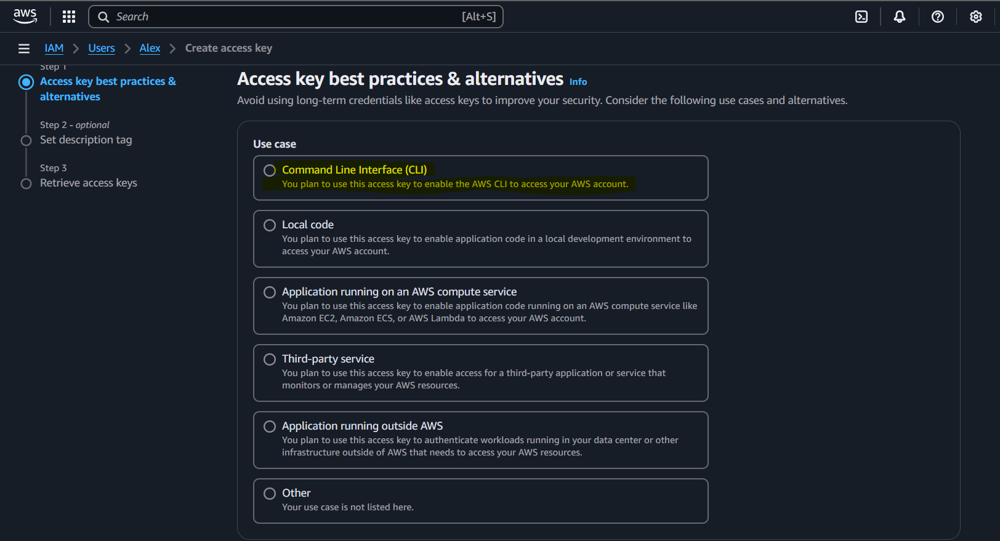

# AWS_CLI_Configuration

## Step - 1 

i. Search AWS CLI download for your operating system in your brower and download it

ii. Once download is completed click on the file and simply do next next and install it

iii. After this , open cmd ans type aws to check wheather it is successfully downloaded or not

## Step - 2

i. Now we want to see the list of users created on our aws platform

ii. for this open cmd and type this cmd ---- aws iam list-users

the iam is for which service we are using 

iii. So here we see this shows unable to alocate credentials , Because we didnt link our aws account with the CLI , To link follow this steps

iv. Go to your user , then Security Credentials , Scroll down , you will see access key , we create access key when we are working with CLI , SDk or APIs

v. Lets create a Access key

v. Now define your use case , for what purpose you are creating access key , i'm doing it for CLI

vi. Click on confirmation and next , next

vii. You will see this

## Step - 3

i. Open cmd to configure , write this command first ---------- aws configure , then it will ask for Access key and Secrete acccess key , simply just copy and past , then it will ask for region check region from aws dashboard

ii. To Check your region

iii. Now, Type the same command again and you will see the list of users 

